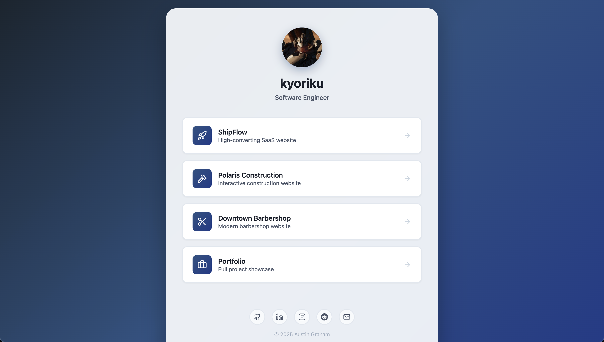

# Personal Link Hub

A custom landing page for portfolio and social links with clean design and smooth animations.

**[Live Site](https://kyoriku.dev)** | **Tech Stack:** JavaScript, HTML, CSS

**Key Features:** Responsive card layout • Animated hover effects • Gradient background • Social media integration

<b>Built With</b>

## Technical Details

**Frontend**
- Pure vanilla JavaScript with no frameworks
- CSS Grid and Flexbox for responsive layouts
- Lucide icons for UI elements

**Interactive Features**
- JavaScript-generated link cards from data array
- Smooth hover animations with transform effects
- Responsive design for mobile and desktop
- External link handling with proper attributes

**UI/UX**
- Card-based layout with gradient background
- Profile avatar with rounded design
- Social media icon buttons with hover states
- Fade-in animation on page load

## License

This project is licensed under the [MIT](https://opensource.org/licenses/MIT) license.

## Questions
For questions, email me at devkyoriku@gmail.com.